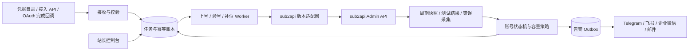

> 历史设计提案：含尚未实现的架构/策略设想，不代表当前功能或默认设置。当前行为以根目录 README 和对应实现文档为准。

# Sub2Easy 号池自动上号与维护设计

## 1. 结论与范围

做一个独立部署在 sub2api 旁边的控制服务，通过 Admin API 工作，不直接改 sub2api 的数据库，不接管模型转发链路。控制服务故障时，sub2api 继续转发；系统恢复后通过持久化任务和对账续跑。

站长的日常应该是：**交付账号材料、确认少量需要重新登录的账号、看容量与异常摘要**，而不是逐个点刷新、测试、启停。

本设计中「自动上号」指：从目录/API 收取已有账号材料，校验、去重、授权、绑定代理、验号、分组并上线。已确认材料格式为一行一份 `账号----密码----TOTP种子`，站长提供的重授权接口会返回 sub2json；首次导入和后续 401 修复共用身份映射，但分别走新建和原账号凭据更新。接口请求/响应合同尚待提供。具体关系与字段权威以 `docs/import-reauth-sync.md` 为补充设计准则。

假设第一期单站点、标准分组模式。多站点的数据模型预留 instance_id；simple 模式的路由/隔离行为需要单独验证。

## 2. 已核实的上游能力

研究日期：2026-09-11。上游：[Wei-Shaw/sub2api](https://github.com/Wei-Shaw/sub2api)。

固定研究提交：[`98d86915becae9fe9491a91ffc6defd5235c8d2b`](https://github.com/Wei-Shaw/sub2api/tree/98d86915becae9fe9491a91ffc6defd5235c8d2b)。这是源码基线，不代表你的站点已部署这个版本。

| 能力 | 源码证据 | 我们怎么用 |
| --- | --- | --- |
| 管理员 API Key、管理员 JWT | `backend/internal/server/middleware/admin_auth.go` | 服务用 `x-api-key`；用户调用模型的 Key 不适用 |
| 账号分页、创建、更新、导入、测试、刷新、启停调度 | `backend/internal/server/routes/admin.go`、`backend/internal/handler/admin/account_handler.go` | 封装版本适配器，不走浏览器点按钮 |
| OAuth 后台刷新 | `backend/internal/service/token_refresh_service.go`、`backend/internal/config/config.go` | 优先使用内置刷新，不再起一个竞争刷新器；源码默认每 5 分钟检查、提前 30 分钟刷新 |
| 定时测试、结果保存、可选恢复 | `backend/internal/service/scheduled_test_runner_service.go` | 可复用执行器；同一账号同一模型不能同时配置两套高频测试 |
| Ops 可用性、错误、告警规则与邮件通知 | `backend/internal/server/routes/admin.go`、`backend/internal/service/ops_account_availability.go` | 复用观察信号；Webhook/Telegram 等由管家适配 |
| 配额/探活型渠道监控 | `frontend/src/api/admin/channelMonitor.ts` | 按实际版本选择复用，避免每次都请求模型 |
| 写请求幂等 | `backend/internal/handler/admin/idempotency_helper.go`、`backend/internal/service/idempotency.go` | 创建带 `Idempotency-Key`，本地仍保留永久去重账本 |

### 特别容易踩的五个坑

1. **创建账号不是「先停用再上线」。** 当前 `CreateAccountRequest` 不接受初始 `status` / `schedulable`；服务默认 `active + schedulable=true`。`group_ids=[]` 还可能绑定平台默认组。不能把空分组当隔离，更不能把先建生产账号、再停调度的两次请求描述成原子操作。
2. **测试不是只读操作。** `POST /accounts/:id/test` 会发起上游请求，成功后 handler 还会尝试恢复可恢复状态。响应是 SSE，只有明确 `type=test_complete` 且 `success=true` 才能记成功；遇到 `type=error`、断流、超时或无完成事件均不能记成功。收到完成后还要读回账号状态，不能假定所有服务端后处理均已完成。
3. **响应结构不统一。** 大部分接口返回 `{code,message,data}`；定时测试接口直接返回数组/对象。适配器需要区分，不能无脑读取 `.data`。
4. **Ops 的 available 不是完整调度结果。** 基线中该统计主要检查 active、schedulable、冷却；实际 `Account.IsSchedulable()` 还检查到期、部分类型配额，真实选择还受分组、模型、并发和平台逻辑影响。不能把简单账号数叫作真实容量。
5. **幂等不是永久 exactly-once。** 上游默认写幂等 TTL 为 24 小时，可配置；协调器未初始化时存在直接执行路径。本地必须保存请求标识与账号映射。超时属于「结果未知」，不是「创建失败可再来一个」。

已确认的 Ops WebSocket 是 QPS 等实时信号，**不能当成已存在的账号全生命周期事件流**。第一版用周期对账，不杜撰 webhook。

## 3. 系统结构



### 技术选型

- **第一期：Python 3.12 + FastAPI + httpx + SQLite WAL + 独立单 Worker。** 适合先做通接入、策略、任务和通知。凭据需要落盘时使用成熟 AEAD 库，不自写加密。
- API 与 Worker 分进程；任务不是内存定时器，SQLite 中持久化 `next_run_at/lease_until/attempts`。领取任务用短事务，网络请求在事务外执行。
- 单 Worker 部署只允许一个任务执行所有者；即使误启多个进程也通过数据库租约阻止重复领取。多机扩展改 PostgreSQL 队列与租约；仅当实际吞吐需要再增加 Redis。
- 控制台第二阶段再做，推荐 Vue 3 + TypeScript。先把流程和故障续跑做稳，不先画一个看起来很忙的面板。
- Docker Compose 单独部署、独立持久化卷，不修改现有 sub2api 的 compose/数据库结构。

## 4. 自动上号流水线

```text
RECEIVED → VALIDATED → STAGED → VERIFYING → READY → ACTIVE
               ↓          ↓         ↓
          BAD_FORMAT   RECONCILING  NEEDS_REAUTH / QUARANTINED
```

### 4.1 接收与去重

- 入口先做两种：监听 `inbox/` 中原子重命名完成的三段 TXT 或 sub2json 文件；带独立接入凭据的 `POST /v1/intakes`。
- 文件生产者先写 `.tmp` 再 rename 为 `.txt/.json`，避免读取半个文件；限制单文件大小、字段和批量条数，拒绝符号链接。
- 统一材料包含：`instance_id/source/external_id/platform/type/credentials/proxy_id/target_group_ids`。`external_id` 必须来自稳定账号身份，而不是会轮换的 access token。
- SQLite 唯一约束 `(instance_id, source, external_id)`；跨来源重复再用平台稳定 subject/account_id 检查。没有可靠身份时标为待核对，不能承诺自动跨源去重。
- 生成随机 job_id 并持久化；每一步单独幂等键。凭据变更使用新修订号，不用旧幂等键发送不同 payload。
- 持久化凭据用加密 secret ref，主密钥从部署 secret 注入且与数据库备份分离。完成后及时清理原始材料；审计仅存 ID、摘要和结果码。

### 4.2 隔离创建：上线前必须先打通的环节

基线 API 无初始停调度字段，因此默认路线是：

1. 建立**显式 staging 分组**，不签发业务 Key、不接入 fallback 路由、无生产用户授权；创建时一定传该组 ID。
2. 在测试环境用真实网关路由验证：生产组、默认组、无组请求、fallback 路径都无法选中 staging 账号。若部署为 simple 模式或路由不能隔离，则此路线不成立。
3. 创建后立刻设 `schedulable=false`，并读回。创建至停调度之间依赖的是已验证的分组隔离，不是「请求足够快」。
4. 验证期间保持 staging。测试接口可能清理运行态，因此不能仅靠错误标记当隔离边界。
5. 验号通过 → 确认仍停调度 → 更新到目标分组 → 读回分组与凭据修订状态 → 最后开启调度 → 再读回。
6. 任一步失败维持隔离；通过账本恢复未完成动作，而非从创建步骤重新开始。

**如果 staging 无法提供隔离，建议对 sub2api 做一个极小的 API 扩展**：给 CreateAccountRequest/CreateAccountInput 增加可选 `schedulable` 字段，在第一次数据库 insert 中直接写 false，默认 nil 保留原有行为；自动接入同时强制显式 group_ids。该扩展当前未实现，不能向原接口发送一个无效字段就以为已生效。

### 4.3 验号与上架

- 校验凭据结构、有效期、平台/类型、目标模型、代理 ID、分组是否存在；平台适配器按实际材料选择导入/创建/OAuth 接口。
- 代理优先固定绑定，失效时仅切换配置的备用代理；不因单次抖动随机改变所有账号出口。
- 在 staging 中做一次目标业务模型的小请求，设置截止时间与响应大小上限。成功并不代表账号支持所有模型。
- 通过后进入 READY 备用池或直接上线，由该生产组的目标容量决定。失败分 transient / quota / credential / policy_or_entitlement / unknown 保存。
- 文件原始内容不进入通知；成功文件处理后删去明文，失败材料限期加密保留。只对导入标识发送回执。

## 5. 监听与维护

### 5.1 两层检测，避免把额度浪费在监控上

- **轻量观察**：起步每 60 秒带抖动分页读账号、批量统计或被动用量；完整快照成功后才推进策略。账号很多时按实测接口耗时加大间隔/分片，不并发把后台打满。
- **深度验证**：新号、可恢复异常账号、近期无业务样本账号才进入探测队列。优先已有业务成功/失败记录，不对所有账号每分钟各发一个模型请求。
- 活跃账号初始深度验证周期可设为 30–60 分钟；只是可调起点，需服从探测预算。1000 个账号每 30 分钟测一次就是约 48,000 次/天，绝非「免费监听」。
- 给每个平台/模型设置每日探测请求上限、并发上限、QPS、随机抖动和截止时间；达到预算后停止主动探测，继续被动观察并标注证据变旧。
- 外部调用 `test` 会自动恢复部分状态。需要严格控制恢复时，优先复用 `auto_recover=false` 的内置定时计划或补充专用探测接口，且验证平台测试实现是否还有副作用；二者都不能未经验证当作绝对无副作用接口。

### 5.2 规则矩阵

| 观测 | 判断与动作 | 通知 |
| --- | --- | --- |
| 管理接口 401/403 | 这是管家接入失败，冻结写操作，不把池内账号标死 | 站点级一次告警 |
| 账号 access token 过期 | 先等内置刷新；确认失败后才限次调用 refresh；操作前读回避免与后台轮换竞争 | 连续失败才提示 |
| `invalid_grant`、refresh token 被撤销 | NEEDS_REAUTH，停止刷新循环；有材料且托管的账号限次调用重授权接口、更新原 ID；准备补位 | 自动修复失败或缺少材料才生成待办 |
| 账号请求 403 | 根据结构化错误区分模型权限、订阅、区域、账号限制，不能一律判封号或刷新 | 需要动作时通知 |
| 429、明确配额耗尽 | COOLDOWN；使用 reset_at / Retry-After；模型级限制不能扩大成全账号下线 | 影响组容量才告警 |
| 单次网络超时、502/503 | SUSPECT，退避复测，不立刻停整池 | 默认静默 |
| 同代理多账号同时失败 | 按代理聚合，打开该代理故障熔断；验证备用出口再分批切换 | 一条代理事件 |
| 跨代理同平台同时失败 | 按平台故障处理，暂停大规模刷新、重登与账号隔离动作 | 一条平台事件 |
| 连续账户级失败 | 冷却窗口内确认独立失败后 QUARANTINED，撤出调度并补位 | 状态变更通知 |
| 恢复 | 冷却到期 + 连续两次不同时间的成功证据，先少量恢复；同一份测试结果不能重复计数 | 一次恢复通知 |
| 人工停用/手动撤出调度 | MANUAL_HOLD，自动恢复不得覆盖人工意图 | 不反复催促 |
| 字段缺失、无法分类 | UNKNOWN，保留当前控制状态，停止推断性写操作 | 持续异常再提示版本/兼容性 |

起步参数：3 次独立失败进入隔离；2 次成功退出；重试 30s/120s/600s + jitter。它们是产品默认提案，不是对所有平台通用的事实；明确不可恢复的错误不等 3 次，不做无效重试。

不要自动调用 clear-rate-limit / reset-quota 来「制造健康状态」。冷却和真实上游配额不是一回事，部分平台重置会消耗额度/重置次数，需独立显式策略。默认不自动删除账号。

### 5.3 状态与控制权

健康状态和控制状态分开保存：

- 健康：UNKNOWN / HEALTHY / SUSPECT / COOLDOWN / NEEDS_REAUTH / QUARANTINED。
- 控制：STAGING / STANDBY / ACTIVE / MANUAL_HOLD / RETIRED。
- 当前列表的 `inactive`、`schedulable=false` 无法单独证明是谁设置；初次接管默认视为人工或其他系统持有，不擅自启用。
- 管家只自动恢复自己登记隔离的账号；保存上次写入值、观测版本和操作 ID。执行前读回，有外部变更则冲突挂起。
- 上游普通更新 API 不是完整 compare-and-swap，读后写仍有竞态。第一期约定同一托管组只由一个控制器写入；严格多写者场景需要上游版本条件更新或可靠审计联动。

## 6. 容量与自动补位

容量必须按 **站点 × 平台 × 生产组 × 必需模型** 判断。多分组账号、同一凭据的衍生账号、共享配额的影子账号不能重复计成独立供给。

同时展示三个口径：

1. 列表候选数：active、schedulable 且无已知运行态阻塞，成本最低但证据最弱。
2. 已验证可用数：候选中具备新鲜的目标模型成功证据，且没有更新的反向证据。
3. 有效余量：结合账号/共享配额窗口、剩余并发、RPM 与近期实际吞吐的估计；缺少配额数据必须显示 unknown，不假设无限。

示例策略：组内已验证可用数连续两轮低于配置的最低值，且不是平台/代理公共故障，则从 READY 池按模型、代理、有效期匹配补位。每轮最多补 2 个、每组设置总账号数和每日补入上限；补完再观察，不因仍在冷却立刻继续无限补。

恢复阈值高于低水位阈值，并设置补位冷却避免来回上下架。备用池不足才请求新的账号材料；不会凭空产生新账号。若某模型供给不足，只影响对应模型能力，不把整个组统一判不可用。

## 7. 通知与站长界面

### 通知

- 初版一个通用 Webhook，按你的使用习惯选择 Telegram / 飞书 / 企业微信 / 邮件适配器，不同时做四套。
- 事件键 `instance + scope + failure_class` 去重，持续满足阈值才触发；同一事件 30 分钟内只更新内部计数，不刷屏；严重升级和恢复可突破静默。
- 通知必须含：影响的组/模型、剩余可用数、系统已做什么、你需要做什么、待办链接。默认不发送账号名/邮箱、Key、token 或错误正文。
- 持久化 outbox，失败指数退避，记录渠道返回值和 message_id；投递失败不能被记为已通知。
- 监控服务自己也要监控：单独部署的 uptime check 监测进程与最后成功采集时间。单靠自身发告警，进程挂掉时发不出来。

### 控制台只保留六块

1. 总览：按组/模型的已验证供给、备用池、证据新鲜度。
2. 上号任务：进度、失败阶段、结果未知任务、重新执行/核对。
3. 账号：当前健康、控制归属、下一次动作、最近证据。
4. 待办：需要重新登录、材料有误、备用池不足。
5. 规则：低水位、每日探测预算、通知渠道、暂停自动写入。
6. 审计：谁在何时因什么证据改变了什么字段，以及读回结果。

## 8. API 合约与数据持久化

下列路径统一以 `/api/v1/admin` 为前缀，实际安装逐项检查能力：

| 方法与路径 | 用途/注意事项 |
| --- | --- |
| `GET /accounts?page=1&page_size=100&lite=true&sort_by=id&sort_order=asc` | 完整分页；缺失字段不当健康；lite 也不保证低数据库成本 |
| `GET /accounts/:id` | 写入前检查、写入后读回 |
| `POST /accounts` | 创建，带幂等键；默认可调度，不能直接放生产组 |
| `PUT /accounts/:id` | 只发送需要变更的字段，避免全量覆盖 credentials/extra |
| `POST /accounts/:id/schedulable` | JSON `{"schedulable":false}` 或 true；成功后读回 |
| `POST /accounts/:id/test` | JSON 可含 model_id、prompt；SSE 完成判断，存在恢复副作用 |
| `POST /accounts/:id/refresh` | 限次补救；不可和内置刷新形成风暴 |
| `POST /accounts/:id/apply-oauth-credentials` | 专用重授权路径；凭据更新后尝试清错/缓存失效，但非整个流程原子事务，需读回和验证 |
| `POST /accounts/import/codex-session` | Codex session 格式专用，需确认材料格式和创建语义后接入 |
| `GET /accounts/:id/usage?source=passive` | 优先被动用量；不同平台支持情况需要验证 |
| `GET /ops/account-availability` | Ops 开关可能关闭；缺失时降级为列表级观察，禁止当成全池不可用 |
| `GET /ops/upstream-errors` | 提取结构化故障，不把错误正文转发到通知 |
| `GET /accounts/:id/scheduled-test-plans` | 查已有计划，避免重复创建 |
| `POST /scheduled-test-plans` | model_id、5 段 cron_expression、enabled、max_results、auto_recover |
| `GET /scheduled-test-plans/:id/results` | 按结果 ID 去重，只有新证据推进连续成功/失败计数 |

最小表：

- `instances`：地址、能力矩阵、密钥引用、最后完整采集时间。
- `intakes`：来源身份唯一约束、材料修订、加密引用、sub2api account_id 映射。
- `jobs`：阶段、预期前置条件、幂等键、重试次数、next_run_at、lease_until、结果未知标志。
- `account_observations`：白名单状态、平台/分组/模型、observed_at、事件去重 ID。
- `account_controls`：托管归属、隔离原因、上次写入值、人工冻结标志。
- `pool_policies`：容量目标、备用数量、探测/补位/动作预算。
- `action_audits`：动作意图先落盘、请求结果、读回结果；不存完整请求体。
- `notification_outbox`：事件指纹、状态、渠道、重试时间。

网络请求与本地事务之间采用「先记意图 → 调用 → 读回 → 记结果」，不声称跨系统原子事务。创建超时：保持相同幂等键与原 payload，结合本地映射和远端外部标识核对；超出幂等有效期或无法确认时转人工核对，禁止自动再创建。

## 9. 分阶段落地与验收

### P0 · 本次已落地

- 源码研究与设计文档；零依赖只读预检和离线测试。
- 不发模型请求、不写账号、不创建后台任务或订阅通知。
- 单次输出列表级候选/阻塞/未知统计；真实站点仍未验证。

### P1 · 优先做的可运营闭环

1. 实际站点预检：版本、标准/simple 模式、关键接口、平台/分组/账号规模。
2. Worker + SQLite 账本 + 定期只读采集 + 一种通知适配器 + 独立健康检查。
3. 接一种账号材料格式，完成去重、staging 隔离验证、验号、上线和失败续跑。
4. 按组完成限次异常处理、备用池补位和人工冻结保护；小批量托管验证后扩展。

### P2 · 降低人工待办

OAuth 交互待办、代理故障聚合、模型级容量、成本预算、Web 控制台、操作审计检索、多站点与多 Worker。

### 必须通过的验收场景

- 100 份虚构接入材料重复提交/重启任务，不重复建号；创建完成但响应丢失时正确对账。
- 未验号账号在创建后任意时点都不能被生产路由选中；包含进程恰好在创建后崩溃的情况。
- SSE HTTP 200 + error、断流、缺少完成事件均不能上线。
- 管理 API 超时、认证失败、分页不完整不触发全池故障/全量下线。
- 429 等待重置、不循环清限流；invalid_grant 不无限刷新；同代理故障只发聚合事件。
- 管家重启后保留冷却、连续失败、幂等映射、待发通知和人工冻结。
- 同一成功测试结果重复读取不凑够「连续两次成功」。
- 账号被人工停用后不会被管家自动复活；外部修改与自动操作冲突时停止该动作。
- 告警渠道挂掉后可续投；没有泄露 Key/Token 的日志、响应或通知。
- 探测达到每日预算后停止主动请求；多组或共享配额账号不会重复计供给。
- 管家停机不影响现有网关流量，外部监控可发现采集过期。

## 10. 下一步需要的部署信息

实际 sub2api 版本/镜像标签及标准或 simple 模式；账号平台与大致数量；重授权接口的脱敏请求/响应合同（材料三段格式已确认）；希望用哪个通知渠道。站点地址与 Admin Key 在本地部署环境配置，不放入聊天或 Git。
